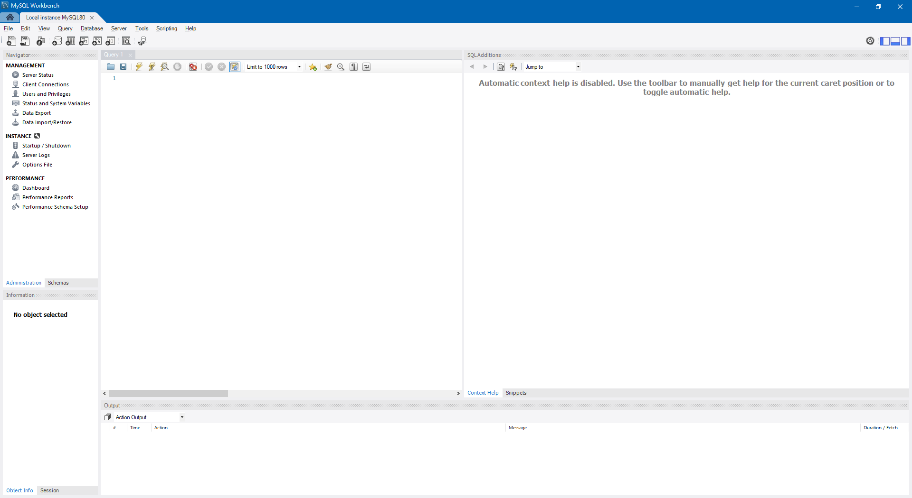

# Connect To MySQL Server
Walking through the steps of connecting to the MySQL Server using mysql command-line client and MySQL Workbench.

## Using MySQL Command-Line Client
- Add the bin directory of the MySQL’s installation folder to the `Path` environment variable.
- Connect to the MySQL Server:
    - Use this command and enter the user's password.
```shell
shell> mysql -u <user> -p
```
```shell
e.g.
shell> mysql -u root -p
Enter password: *******
```
- Display the databases in the current server:
```shell
mysql> show databases;
+--------------------+
| Database           |
+--------------------+
| information_schema |
| mysql              |
| performance_schema |
| sakila             |
| sys                |
| world              |
+--------------------+
6 rows in set (0.09 sec)
```

## Using MySQL Workbench
- Launch the MySQL Workbench.
- Connect to the MySQL Server by choosing `Database` > `Connect to Database…`.
- Select `Stored Connection` and enter `Username`.
- Click `Store in Vault ...` and enter the user's password.
<details>
  <summary>MySQL Workbench</summary>

  
</details>

## References
- [Connect to MySQL Server](https://www.mysqltutorial.org/getting-started-with-mysql/connect-to-mysql-server)
